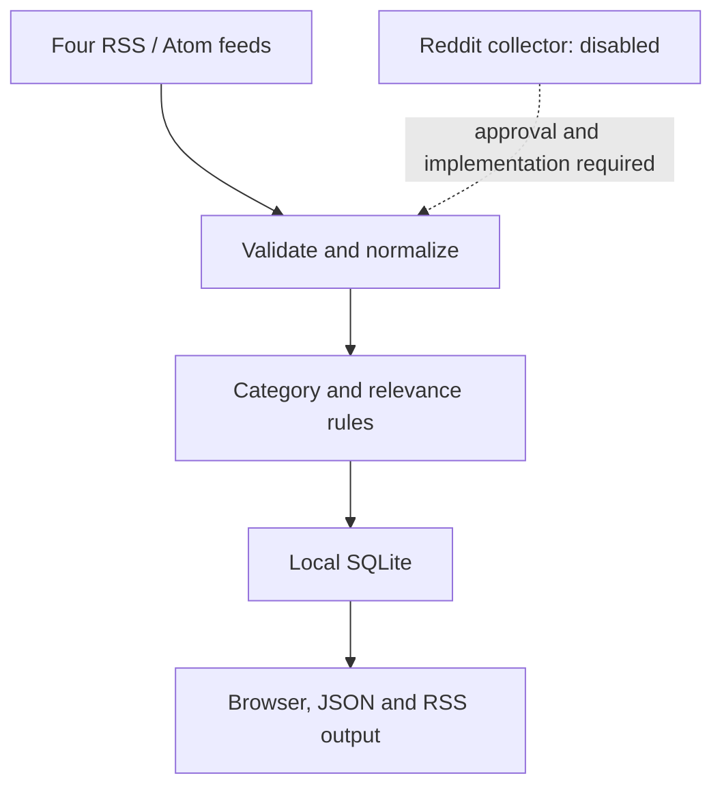

# Architecture

This is the standalone local Golf Radar v0.1 runtime. It does not contain the
full AIHOT backend, scheduled workers or model-analysis pipeline.

1. A user initiates refresh. The server fetches only the configured public feed
   URLs; it does not fetch individual article pages or Reddit.
2. Valid RSS / Atom items become source-linked records. Non-HTTPS links and
   missing titles are skipped; invalid dates remain null. Excerpts are stripped
   of markup and limited to 160 characters. Sports-results/schedule items are
   suppressed by simple rules; this is not an exhaustive editorial classifier.
3. URL upserts deduplicate records. Each feed run records count, time and error.
   Failed sources retain their previous entries. A refresh lock and one-minute
   cooldown limit overlapping manual requests.
4. The UI and feed endpoints share the same stored items. Category observations
   are hypotheses, not evidence extracted by a model.

The Node server binds to `127.0.0.1`, validates Host and checks same-origin
refresh requests. SQLite files, environment variables and dependencies are
excluded from source control. No user accounts, cookies or credentials are
required for this local MVP.

## Data model

- `radar_articles`: URL primary key and normalized article JSON.
- `radar_feed_runs`: latest refresh result for each source.
- `radar_meta`: refresh lock and latest refresh time.
- Article JSON: title, URL, original publication time, observation time, source
  identity/tier, category, priority and short source excerpt.

Publication time and observation time are distinct. Source tier indicates the
kind of source (brand official versus media), not a truth score.

## Boundaries and next steps

Reddit and Sorftime are not inputs yet. They must not be simulated with invented
posts or silently substituted with scraped data. Reddit needs approved access
and intended-use permissions; Sorftime needs verified tools, terms, quotas and
costs. Implement retention/deletion and permitted storage for any new source
before enabling collection. Scheduling, event clustering and AI analysis remain
separate future work.
